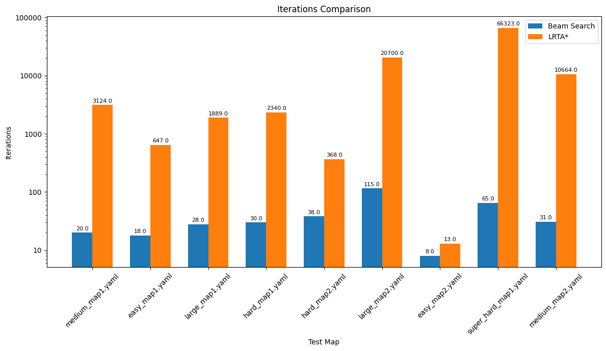

# Sokoban Solver

A pathfinding solution for the Sokoban puzzle game using Beam Search and LRTA* (Learning Real-Time A*) algorithms.

## Overview

This project implements two state-space search algorithms to solve Sokoban puzzles:
- **Beam Search**: A breadth-first search variant that keeps only the K best states in each iteration
- **LRTA (Learning Real-Time A\*)**: A real-time heuristic search algorithm that learns better heuristic values while exploring

Both implementations use Manhattan Distance as the heuristic function without the box "pull" technique.

## Features

### Heuristic Function
The Manhattan Distance heuristic consists of two components:
1. Finding the shortest distance from each box to its closest target
2. Calculating the distance from the player to each box

The final heuristic sums these distances. Additionally, the heuristic detects when boxes are trapped in corners (dead positions) and assigns them a maximum cost.

### LRTA* Implementation
- Uses a learning mechanism to store and update heuristic values in a table
- Selects neighbors with the lowest estimated cost (f = cost + heuristic) and fewest visits
- Implements a reset mechanism after 200 iterations to avoid infinite loops
- Tracks node expansions to measure efficiency

### Beam Search Implementation
- Explores the state space while maintaining only the best K states in each iteration
- Starts with initial state neighbors and generates all possible next states
- Sorts candidates by heuristic value and keeps only the top K states
- Uses two key optimizations:
  1. A "parents" dictionary for path reconstruction
  2. String representation of states as dictionary keys for efficient duplicate detection

## Performance Analysis

The performance comparison between the two algorithms shows:

- **LRTA***:
  - Generally slower execution time (up to 10x slower in complex scenarios)
  - Requires more iterations (e.g., 66,323 vs 65 in "super_hard_map1.yaml")
  - Better performance in some specific map structures (e.g., "easy_map2.yaml")

- **Beam Search**:
  - Faster execution in most cases
  - Performs more node expansions in the majority of test cases
  - Particularly efficient in complex scenarios like "super_hard_map1.yaml"

Performance varies based on map structure, suggesting that the efficiency of each algorithm depends on the specific characteristics of the puzzle being solved.

## Implementation Details

- States are tracked efficiently using string representations
- A checker traverses all test cases to verify solutions
- The reset threshold for LRTA* was optimized from 50 to 200 iterations, significantly improving performance (reducing explored states from ~260,000 to ~66,000 in complex maps)

## Usage

To run the solver on all test maps:

```python
python sokoban_solver.py
```

To test specific algorithms:

```python
python sokoban_solver.py --algorithm beam_search
python sokoban_solver.py --algorithm lrta_star
```

## Performance Visualization

The repository includes tools to visualize key performance metrics comparing both algorithms:

### Execution Time Comparison

*Figure 1: Comparison of execution time between Beam Search and LRTA* across different maps.*

### Iteration Count Comparison

*Figure 2: Comparison of iteration counts required by Beam Search and LRTA* to solve each map.*

### Node Expansion Comparison

*Figure 3: Comparison of node expansions performed by each algorithm during the search process.*

These visualizations help understand the performance trade-offs between the two algorithms across different map complexities. As shown in the charts, LRTA* typically requires more iterations but may perform fewer node expansions in certain scenarios, while Beam Search generally has faster execution times but may explore more states.

### Solution Animations

The `images` directory also contains animated GIFs showing the step-by-step solution process for various maps:


*Figure 4: Beam Search solving a complex Sokoban puzzle.*


*Figure 5: LRTA* algorithm finding a solution path.*

These animations provide a visual demonstration of how each algorithm navigates through the state space and approaches the solution differently. They help illustrate the search patterns and efficiency of movement between the two algorithms.

## Requirements
- Python 3.6+
- NumPy
- Matplotlib (for visualizations)
- PyYAML (for map loading)